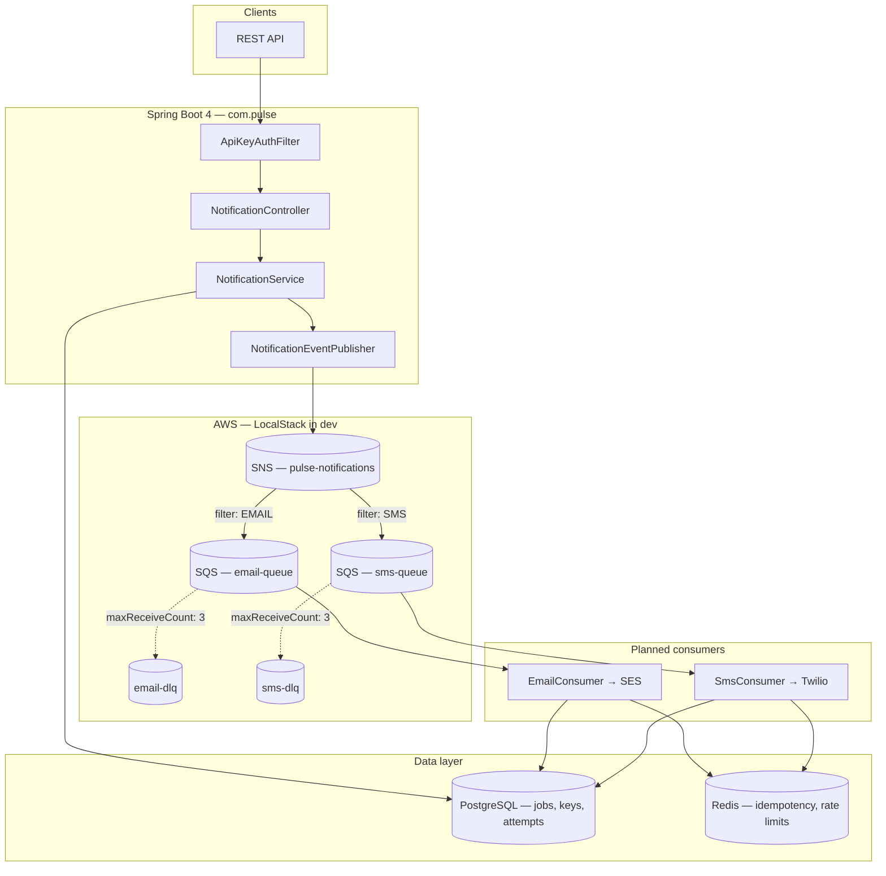

# Pulse

**Pulse** is an event-driven notification platform for delivering messages across email and SMS using an AWS SNS fan-out architecture with per-channel SQS consumers.

> *Pulse*: the signal that something happened — a heartbeat from your application to your users.

---

## Architecture

Pulse accepts notification jobs over a REST API, persists them to PostgreSQL, and publishes events to a central SNS topic that fans out to per-channel SQS queues. Each channel is processed independently with retry logic, dead-letter queues, and Redis-backed idempotency.



### Why SNS fan-out?

Publishing directly to a single queue and routing by channel inside one consumer couples every channel to a single worker. SNS fan-out decouples routing entirely — each channel is an independent subscriber with its own queue, retry policy, and dead-letter queue.

Adding a new channel (e.g. push) means creating a new SQS queue and SNS subscription with a message filter. No changes to the producer or existing consumers. Message filter policies on the `channel` attribute ensure each queue only receives relevant events.

### Package layout

```
com.pulse/
├── PulseApplication.java
├── api/
│   ├── controller/          # NotificationController
│   ├── dto/                 # NotificationRequest, NotificationResponse
│   └── exception/           # GlobalExceptionHandler, JobNotFoundException
├── auth/                    # ApiKeyAuthFilter (X-API-Key, SHA-256)
├── config/                  # SecurityConfig, AwsConfig (SNS/SQS clients)
├── domain/                  # NotificationJob, ApiKey, Channel, enums
├── notification/
│   ├── service/             # NotificationService
│   └── publisher/           # NotificationEventPublisher
└── repository/              # JPA repositories
```

### Design decisions

| Concern | Approach |
|--------|----------|
| **Auth** | API keys passed via `X-API-Key` header; stored as SHA-256 hashes in PostgreSQL. |
| **Job lifecycle** | `PENDING` → `PROCESSING` → `DELIVERED` / `FAILED`. Jobs persisted before SNS publish. |
| **Fan-out** | One SNS message per channel with a `channel` message attribute for filter policies. |
| **Idempotency** | Optional `idempotencyKey` on create; Redis `SET NX` dedup planned for consumers. |
| **Channel isolation** | Separate SQS queues and DLQs per channel — a Twilio outage does not block email. |
| **Local dev** | LocalStack emulates SNS, SQS, and SES; `aws-init` provisions queues and subscriptions on startup. |

### Tech stack

- Java 21, Spring Boot 4.0.6
- PostgreSQL 16 (Docker) — jobs, API keys, delivery attempts
- Redis 7 (Docker) — idempotency and rate limiting (planned)
- AWS SNS + SQS + SES via AWS SDK v2
- LocalStack 3 — local AWS emulation
- Spring Data JPA + Flyway
- Spring Security (API key filter)

---

## Prerequisites

- Java 21
- Docker Desktop (for Postgres, Redis, and LocalStack)

---

## Local setup

### 1. Start infrastructure

```bash
docker compose up -d
```

This starts:

| Service | Host port | Purpose |
|---------|-----------|---------|
| `pulse-postgres` | **5433** | PostgreSQL (avoids conflict with a local install on 5432) |
| `pulse-redis` | 6379 | Redis |
| `pulse-localstack` | 4566 | SNS, SQS, SES emulation |
| `pulse-aws-init` | — | One-shot: creates SNS topic, queues, DLQs, and subscriptions |

Wait for all containers to be healthy. The `aws-init` container provisions:

- SNS topic: `pulse-notifications`
- Queues: `email-queue`, `sms-queue` (with `email-dlq`, `sms-dlq`)
- Filtered SNS → SQS subscriptions (`channel = EMAIL` / `channel = SMS`)

### 2. Seed a dev API key

API keys are stored as SHA-256 hashes. Insert a local dev key:

```sql
INSERT INTO api_keys (name, key_hash)
VALUES (
  'dev-key',
  'ad2be3b1edd1a3e7837e53b8db58da0ca4e54e82c328e1cf863dff824268cc35'
);
```

Run via Docker:

```bash
docker exec -i pulse-postgres psql -U pulse -d pulse -c \
  "INSERT INTO api_keys (name, key_hash) VALUES ('dev-key', 'ad2be3b1edd1a3e7837e53b8db58da0ca4e54e82c328e1cf863dff824268cc35') ON CONFLICT DO NOTHING;"
```

Raw key value: `pulse-dev-key-local`

### 3. Run the application

```bash
./mvnw spring-boot:run
```

On Windows:

```powershell
.\mvnw.cmd spring-boot:run
```

Health check: `GET http://localhost:8080/actuator/health`

---

## API overview

All endpoints except `/actuator/*` require:

```
X-API-Key: <your-api-key>
```

### Notifications

| Method | Path | Status | Description |
|--------|------|--------|-------------|
| POST | `/api/v1/notifications` | 202 | Create and enqueue a notification job |
| GET | `/api/v1/notifications/{id}` | 200 | Get job status by ID |

**Create notification**

```bash
curl -X POST http://localhost:8080/api/v1/notifications \
  -H "X-API-Key: pulse-dev-key-local" \
  -H "Content-Type: application/json" \
  -d '{
    "channels": ["EMAIL"],
    "subject": "Hello",
    "body": "Hello world",
    "recipientEmail": "test@example.com"
  }'
```

Response `202 Accepted`:

```json
{
  "jobId": "uuid",
  "status": "PROCESSING",
  "channels": ["EMAIL"],
  "createdAt": "2026-06-05T18:23:06.395Z"
}
```

**Get job status**

```bash
curl http://localhost:8080/api/v1/notifications/{jobId} \
  -H "X-API-Key: pulse-dev-key-local"
```

### Error responses

| Status | Cause |
|--------|-------|
| 401 | Missing or invalid `X-API-Key` |
| 400 | Validation failure (missing `channels`, blank `body`, etc.) |
| 404 | Job not found |

### Planned endpoints

| Method | Path | Description |
|--------|------|-------------|
| GET | `/api/v1/notifications` | List jobs with filtering and pagination |
| POST/GET/PUT | `/api/v1/templates` | Template CRUD with variable substitution |
| GET | `/api/v1/admin/dlq` | Inspect dead-letter queue messages |
| POST | `/api/v1/admin/dlq/{messageId}/reprocess` | Reprocess a failed message |
| GET | `/api/v1/admin/metrics/summary` | Delivery metrics summary |

---

## Notification flow

1. Client sends `POST /api/v1/notifications` with channel(s), body, and recipient fields.
2. `ApiKeyAuthFilter` validates the API key (SHA-256 lookup in PostgreSQL).
3. `NotificationService` persists a `notification_jobs` record and publishes one SNS message per channel.
4. SNS fans out to `email-queue` and `sms-queue` via channel filter policies.
5. *(Planned)* Per-channel SQS consumers deliver via SES (email) or Twilio (SMS), with Redis idempotency and retry → DLQ on exhaustion.

---

## Configuration

| File | Purpose |
|------|---------|
| `application.properties` | Postgres URL, Redis, AWS/LocalStack endpoints, SNS topic ARN, SQS queue URLs |
| `docker-compose.yml` | Local Postgres, Redis, LocalStack, and AWS resource provisioning |
| `scripts/setup-localstack.sh` | Creates SNS topic, SQS queues, DLQs, and filtered subscriptions |

Key properties:

```properties
spring.datasource.url=jdbc:postgresql://localhost:5433/pulse
aws.endpoint=http://localhost:4566
aws.sns.topicArn=arn:aws:sns:us-east-1:000000000000:pulse-notifications
```

---

## Roadmap

- [ ] SQS consumers (email via SES, SMS via Twilio)
- [ ] Redis idempotency (`SET NX` dedup on consumer)
- [ ] Retry with exponential backoff + jitter
- [ ] Admin DLQ inspection and reprocessing
- [ ] Rate limiting (100 req/min per API key)
- [ ] Template engine
- [ ] Scheduled notifications
- [ ] CloudWatch metrics and structured JSON logging
- [ ] ECS Fargate deployment + GitHub Actions CI/CD

---

## Author

**Nvafeomo K. Konneh**

- **Email:** [nvafeomo05@gmail.com](mailto:nvafeomo05@gmail.com)
- **LinkedIn:** [Nvafeomo Konneh](https://www.linkedin.com/in/nvafeomo-konneh-a6a1a9367)

---

## License

[MIT License](LICENSE) — Copyright (c) 2026 Nvafeomo Konneh.

Third-party dependencies (Spring Boot, AWS SDK, etc.) remain under their respective open-source licenses.
